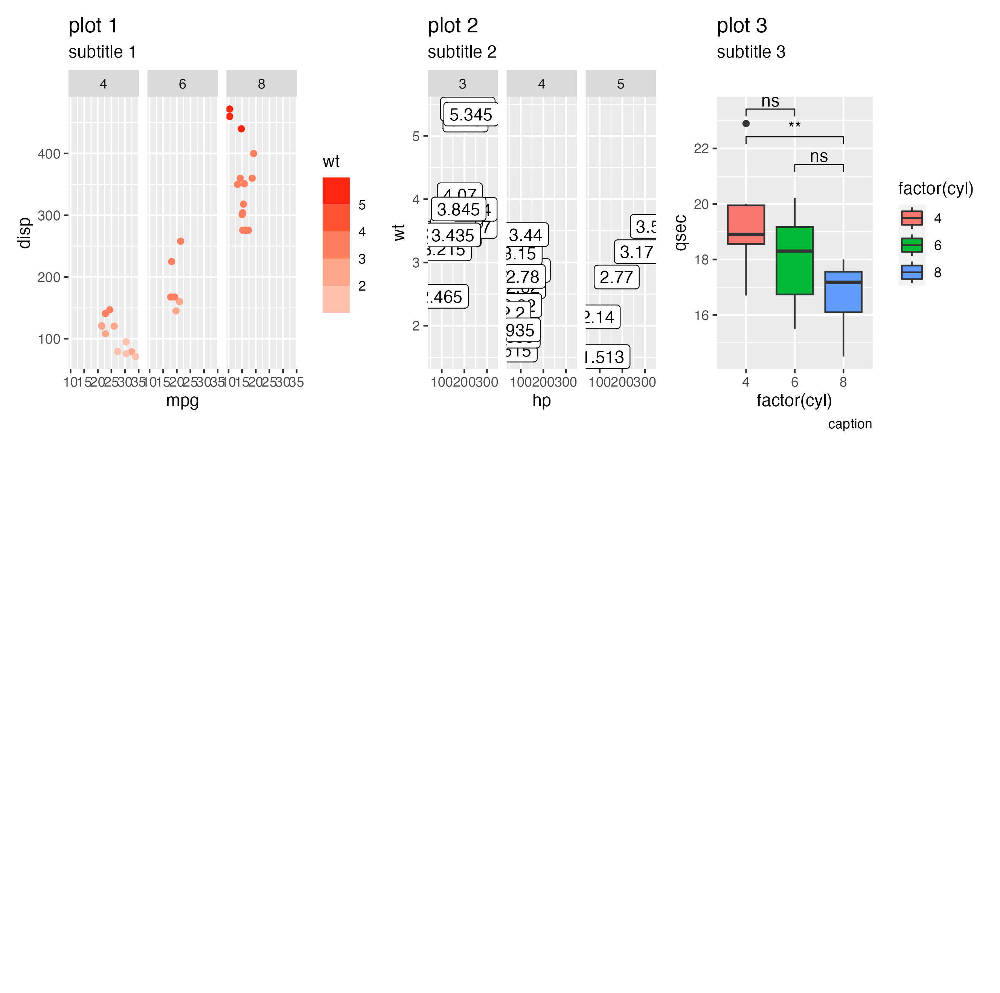

# autoggsaveR

`autoggsaveR` is an R package that provides functions to automatically save a list of ggplot objects as a single image. It calculates the optimal dimensions for the final plot based on the number of plots, layers, facets, and the maximum number of items on the x and y axes.

## Installation

You can install the `autoggsaveR` package from GitHub using `devtools`:

```r
install.packages("devtools")
devtools::install_github("nicholas-camarda/autoggsaveR")
```

## Usage

```r
# Load the package
library(autoggsaveR)

# Create a list of plots
p1 <- ggplot(mtcars, aes(mpg, disp)) +
  geom_point()
p2 <- ggplot(mtcars, aes(hp, wt)) +
  geom_point()
plot_lst <- list(p1, p2)
```

You can get information about the plots using the `get_plot_info` function:

```r
plot_info <- get_plot_info(plot_lst)
print(plot_info)

# $num_plots
# [1] 2

# $num_layers
# [1] 2

# $num_facets
# [1] 0

```

You can also get the number of items on the x and y axes of a plot using the `get_num_plot_items` function:

```r
axes_info <- get_num_plot_items(p1)
print(axes_info)

# $num_x_items
# [1] 25

# $num_y_items
# [1] 27
```

Finally, you can save the plots as a single image using the auto_save_plot function. This will save the plots as a single image in a directory you specify relative to your working directory. The output directory will be created recursively if it doesn't exist:

```r
auto_save_plot(
    plot = plot_lst, 
    relative_output_dir = "output_dir", 
    file_name = "my_plots.png", 
    base_size = 20, 
    ncol = 1,
    verbose = TRUE
)
```

## Example plot

```r
  p1 <- ggplot2::ggplot(mtcars, ggplot2::aes(mpg, disp)) +
    ggplot2::geom_point() +
    ggplot2::facet_wrap(~`cyl`)
  p2 <- ggplot2::ggplot(mtcars, ggplot2::aes(hp, wt)) +
    ggplot2::geom_point() +
    ggplot2::facet_wrap(~`gear`)
  p3 <- ggplot2::ggplot(mtcars, ggplot2::aes(drat, qsec)) +
    ggplot2::geom_point() +
    ggplot2::facet_wrap(~`carb`)
  plot_lst <- list(p1, p2, p3)
```

Without `autoggsaveR`:

```r
library(patchwork)
ggsave(plot = p1 + p2 + p3, filename = file.path("example_images", "test-no_auto.png"))

# Saving 8.33 x 7.25 in image
```


With `autoggsaveR`, the dimensions are more appealing:

```r
library(autoggsaveR)
auto_save_plot(
    plot = plot_lst, 
    relative_output_dir = "example_images", 
    file_name = "test_withauto.png", 
    base_size = 20, 
    ncol = 1,
    verbose = TRUE
)
# Found:
#             num_plots = 3
#             num_layers = 3
#             num_facets = 12
# For individual plots:
# Found:
#             num_plots = 1
#             num_layers = 1
#             num_facets = 3
# Found:
#             num_plots = 1
#             num_layers = 1
#             num_facets = 3
# Found:
#             num_plots = 1
#             num_layers = 1
#             num_facets = 6
# Adjusted base size = 12.4921966137515
# Plotting with height = 12.0354382112558 and width = 12.2177597680498 
```


